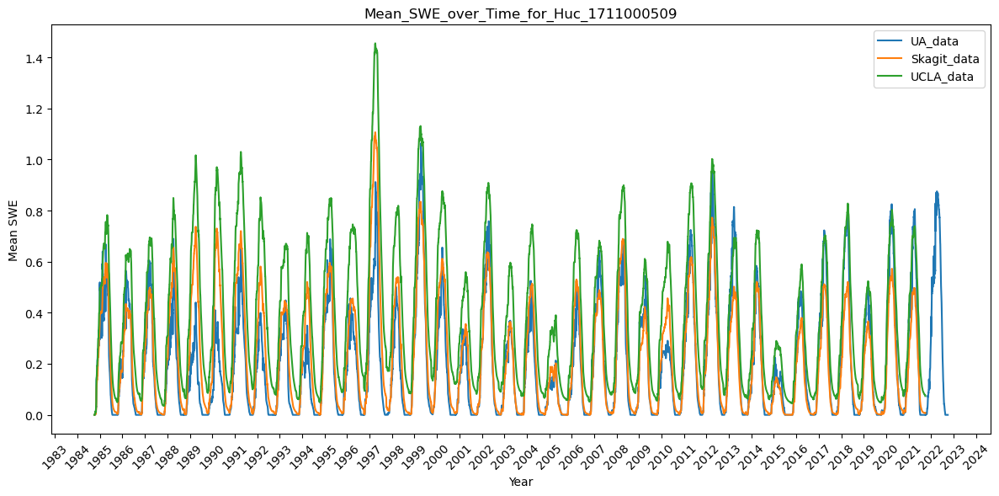

This document examines SWE estimates for two HUC10 units in Skagit basin from three different data sources: 

- The University of Arizona data (UA) (https://climate.arizona.edu/data/UA_SWE/);
- The UCLA data, retrieved using the code in [this repo](https://github.com/DSHydro/swesr); and
- The Skagit data from ?? ("Skagit Original").

Refer to [this notebook](..notebooks/Verify_Pipeline/Compare_SWE.ipynb) for futher details.  

| HUC 1711000504 | HUC 1711000509 |
|:--:|:--:|
|  | 

