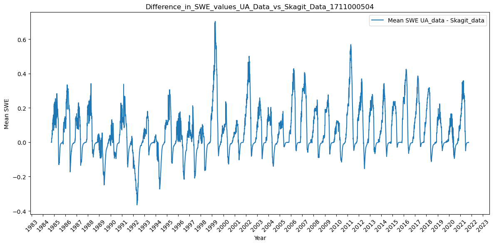
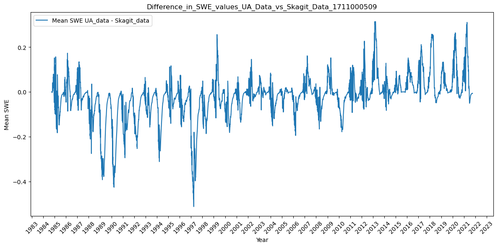
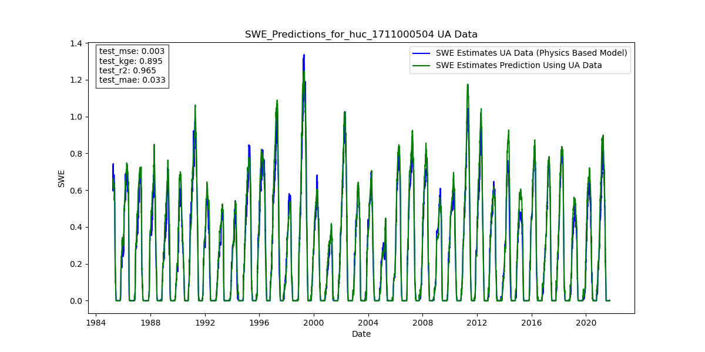
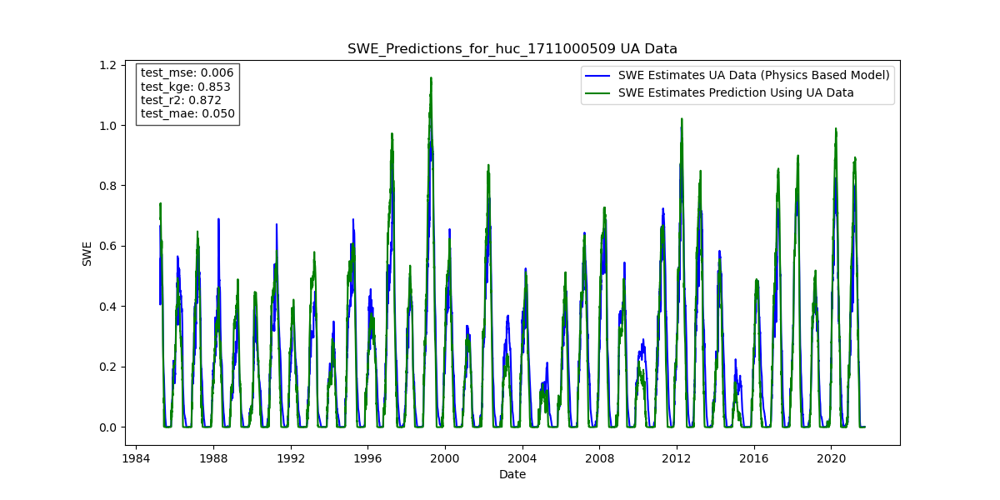
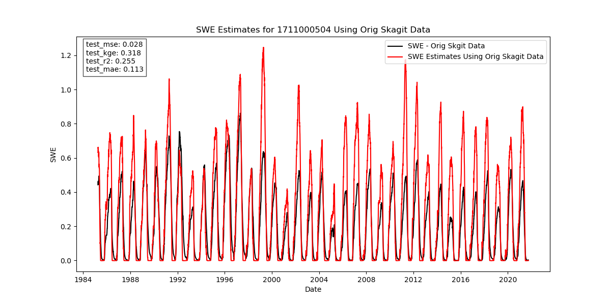
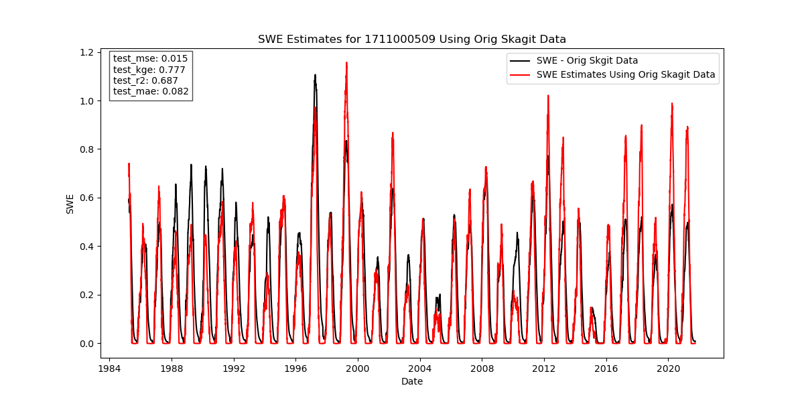
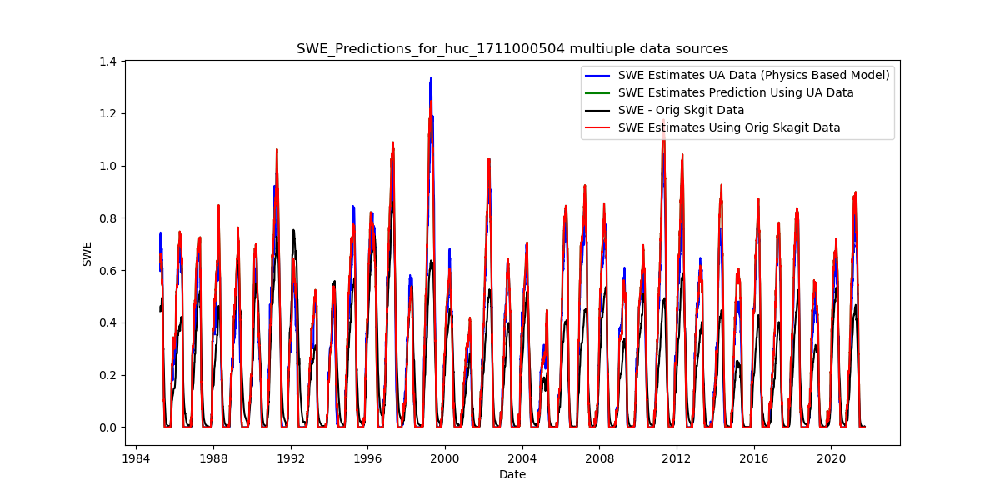
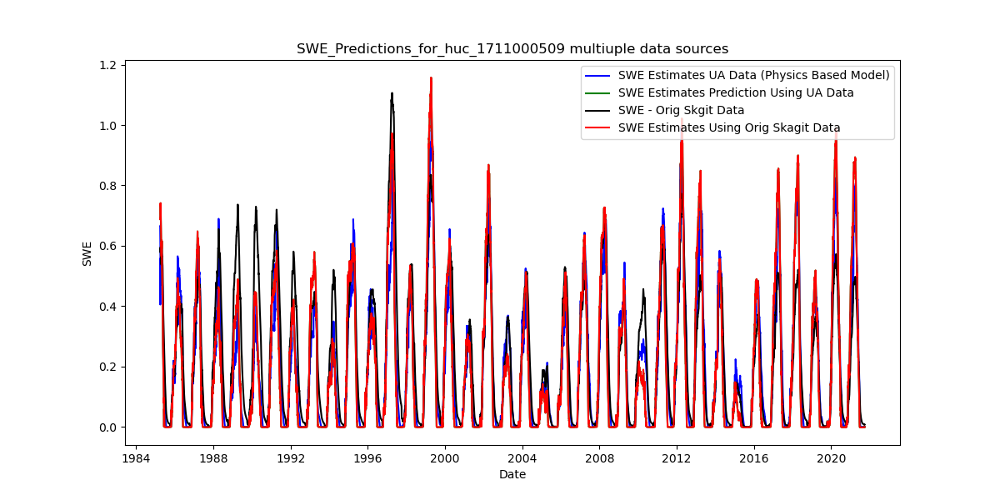

This document examines SWE estimates for two HUC10 units in Skagit basin from three different data sources: 

- The University of Arizona data (UA) (https://climate.arizona.edu/data/UA_SWE/);
- The UCLA data, retrieved using the code in [this repo](https://github.com/DSHydro/swesr); and
- The Skagit data from ?? ("Skagit Original").

Refer to [this notebook](..notebooks/Verify_Pipeline/Compare_SWE.ipynb) for futher details.  

| HUC 1711000504 | HUC 1711000509 |
|:--:|:--:|
|  | |
|  | 

Graphs below show prediction results vs. actual data using the UA and Skagit original data fed into an LSTM model that was trained on UA data from 162 Huc 12 sub-watersheds where Maritme and Montane Forest snow predominates, using precipitation, air temperature, and basin elevation as feature variables.  Refer to [Expirement 3 doumentation] (https://github.com/DSHydro/SnowML/blob/main/docs/Ex3_MultiHucTraining.md) for details on the multi-huc training approach. 

The first row shows results using UA data fed into the UA-data-trained-model.  KGE is relatively high (>.85) for both -04 and -09. 
The next row shows results using Original Skagit data fed into the UA-data-trained model. Not surprisingly the prediction results deteriorate, especially for -04 where the UA and Skagit original data sets diverge significantly.  The final row of graphs shows all results on the same axes.  

| HUC 1711000504 | HUC 1711000509 |
|:--:|:--:|
|  | |
| | |
|| |
