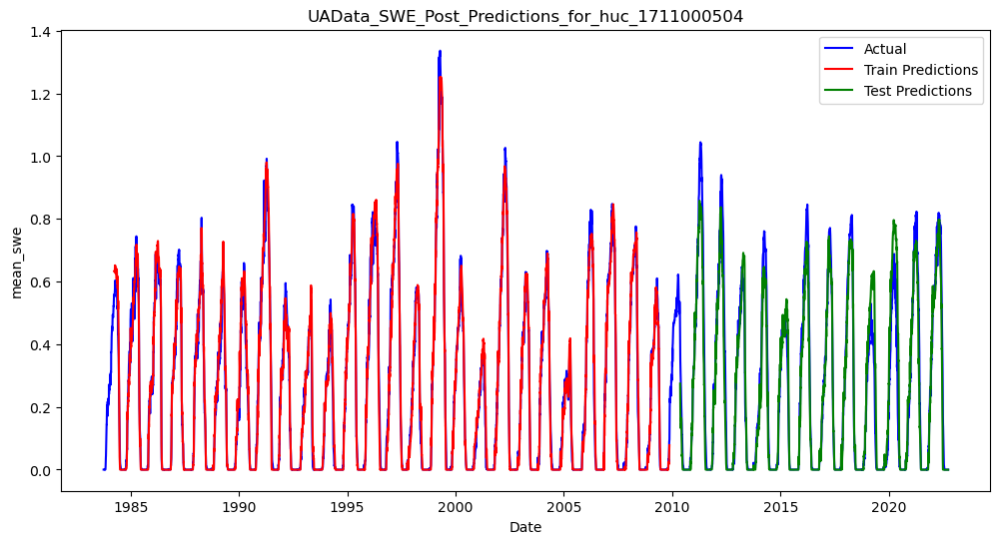
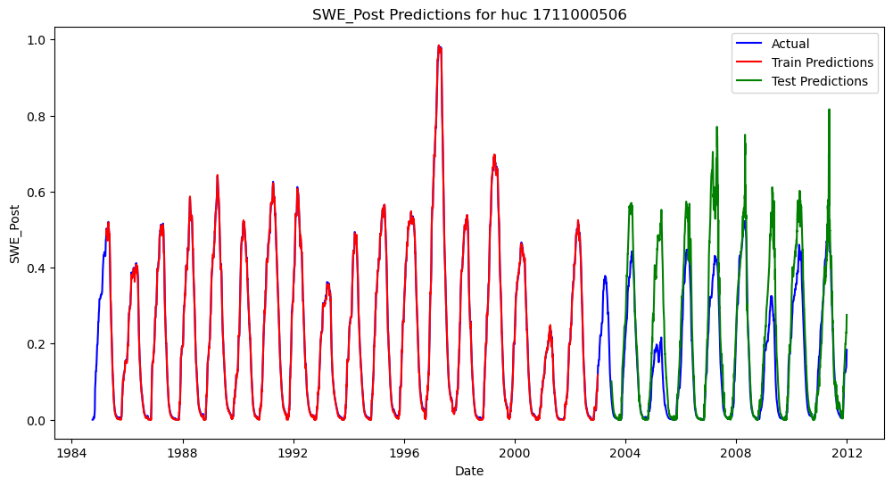

# Expirement: Use more Data! 

** TO DO: Explain that the original prototyped model was run on 8 watersheds within Skagit and we did same **

The first adjustment we made to the proptoyped LSTM Model was to use the University of Arizona estimates of Snow Water Equivilent (SWE) [data]( https://climate.arizona.edu/data/UA_SWE/) as our target dataset for training and evaluating the model. This dataset contains a longer time series of available SWE data than used in the protoyped model. 

We reran the protoype LSTM model with the new data, leaving all other hyperparmeters unchanged except one. We reduced the number of epochs to 10 after observing early convergence of the model -- possibly due to the increased training data available. The graphs below compare the prior data run at 200 epochs with the new data run at 10 epochs, but the observations are robust to the number of epochs used (10 vs. 200) in the prototype model. Please refer to the [Viz10COmpare notebook](notebooks/Prototype_Model_Results/VizHuc10Compare.ipynb) for sensitivy analysis related to number of epochs used.  

In this expirement 1A, all watersheds were trained *only* using the data from that sub-watershed,as noted below by the paramenter (pre_train_fraction = 0).  Train/test split was accomplished by reserving the final two thirds of the time period as test data. 

# Observations and Results 

**More Data = Better Results**
Including longer time series of data generally increased model fit.  Figure 1 below graphs actual and predicted levels of swe for two example Huc12 units, 1711000504 and 171100506.  From visual inspection, using the longer time series from the UA data set appears to decrease overfitting and aid model performance. These observations are confimed by two goodness of fit measures: Mean Squared Error ("MSE"), and  Klinge-Gupta Efficiency, (https://en.wikipedia.org/wiki/Kling%E2%80%93Gupta_efficiency), a metric commonly used to assess the performance of hydrological models. KGE is a composite measure that considers (i) Correlation (r) between observed and simulated data, (ii) the Bias (β) assesaws S the ratio of the mean of simulated data to the mean of observed data, and (iii) Variability (y), which compares the standard deviations of simulated and observed data to evaluate the model's ability to reproduce the variability in the observed data.  It is calculated as KGE=1− sqrt((r−1)^2+(β−1)^2+(γ−1)^2).  KGE values range from negative infinity to 1, with a KGE value of 1 indicating perfect agreement between the simulated and observed data.   

**Discrepency in Model Performance Accross Different Huc12 Units**
**Variability in "Actual" SWE Between UA and SnowTel Datasets**

# Limitations and Questions For Further Research**

**Mean Square Error**  The Prototyped Model with UA Data has a test_mean_squared_error of .0054 which is a significnat improvement over the prior value of .0138.  

** Kling-Gupta Efficiency** We also evaluate model results in terms of

For huc 1711000504 **TO DO - maybe give it a name** the test KGE was an eye popping .94, compared to a value of .47 using the prior data.  

# Results For All 8 Watersheds 

Using the longer time series data showed test KGE improvements for each of the eight watersheds tested, as shown in the third chart below. Mean Squared Error results were more mixed. In the majority of watersheds, mean squared error improved when running the model with the longer time series of data, but in two watersheds, the model deteriorated with the increased time series of data. **TO DO** Also note differences in "truth" SWE - a reminder that our predictions are limited by the accuracy of our "ground truth" data/  

Interestingly, the model performed dramatically better in some watersheds than in others. We further explore differences in model performance by watershed is explored in later expirements. 

## ProtoTyped Model - UA Data vs. Original Data

## ProtoTyped Model - UA Data vs. Original Data

## Figure1- UA Data vs. Original Data, Prediction Plots for two Example HUC12 Units - 1711000504 and 1711000506

| ProtoTyped Model - UA Data | ProtoTyped Model - Original Data |
|----------------------------|---------------------------------|
|  |  |
|  |  |

## What is KGE? 
Klinge-Gupta Efficiency, (https://en.wikipedia.org/wiki/Kling%E2%80%93Gupta_efficiency), a metri is commonly used to assess the performance of hydrological models. KGE is a composite measure that considers (i) Correlation (r) between observed and simulated data, (ii) the Bias (β) assesaws S the ratio of the mean of simulated data to the mean of observed data, and (iii) Variability (y), which compares the standard deviations of simulated and observed data to evaluate the model's ability to reproduce the variability in the observed data.  It is calculated as KGE=1− sqrt((r−1)^2+(β−1)^2+(γ−1)^2).  

KGE values range from negative infinity to 1, with a KGE value of 1 indicating perfect agreement between the simulated and observed data. A model which simply predicts the mean will have a KGE of -0.44.  What is considered a "good" KGE score is context specific.  For our expirements, we considered KGE > 0.7 to be acceptable, KGE >0.8 to be good, and KGE > 0.9 to be excellent based on literature reviwe of similar expirements.  

## Model Details: ProtoTyped Model - UA Data 
| Parameter           | Value                       |
|---------------------|-----------------------------|
||

