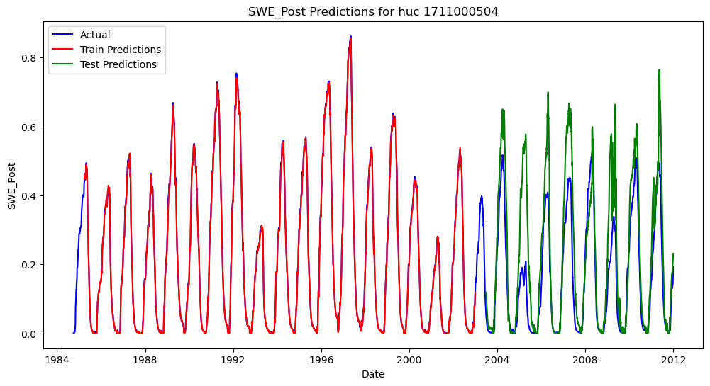
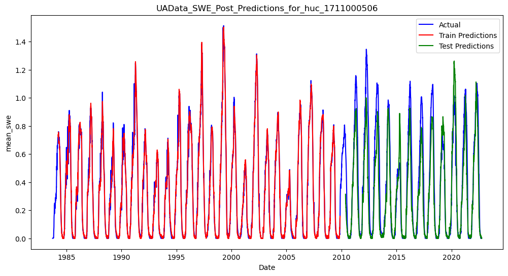

# Expirement 1: Use more Data! 

**The Prototyped LSTM Model**  
The Frosty Dawgs team did not start from scratch.  We were grateful to use as our starting point an LSTM Model that had been prototyped in Skagit Basin ("Prototyped LSTM Model") using as the target variable daily estimates of Snow Water Equivilent ("SWE") data from 1985 to 2012, and daily temperature and precipitation oer the same period data as models features.  

**Watershed Level Training**  
The Prototyped LSTM Model was run at watershed scale - meaning that for each locally trained watershed, the target and feature variables were aggregated into a daily mean value for the entire watershed being trained or predicted.  We also followed this watershed scale training approach. Specifically, a separate model was trained for each of 7 different "Huc10" watershed basins as depicted in Figure 1 below.  

Training at watershed scale is advantageous because it reduces computation, and averages out imprecisions that arise from dataset gridding misalignment and/or methods used when large scale meteorological datasets are "downscaled" using statistical methods. Predictions at the watershed scale are also more readily interpretable for water managers and others. On the other hand, watershed scale training over large areas may obscure important differences local differences in elevation, terrain, or other variables resulting in some loss of fidelity. As one of our research questions was to determine whether waterhsedscale training is a viable approach, we continued with watershed scale training.   

**New Data!**  
The first adjustment we made to the Proptoyped LSTM Model was to use the University of Arizona estimates of Snow Water Equivilent (SWE) [data]( https://climate.arizona.edu/data/UA_SWE/) as our target dataset for training and evaluating the model. This dataset contains a longer time series of available SWE data than used in the protoyped model. 

We reran the Protoyped LSTM Model with the new data, leaving all other hyperparmeters unchanged except one. We reduced the number of epochs to 10 after observing early convergence of the model -- possibly due to the increased training data available. The graphs below compare the prior data run at 200 epochs with the new data run at 10 epochs, but the observations are robust to the number of epochs used. Please refer to the [Viz10COmpare notebook](notebooks/Prototype_Model_Results/VizHuc10Compare.ipynb) for sensitivy analysis related to number of epochs used.  

In this Expirement 1, each Huc10 watershed was trained *only* using the data from that watershed. Train/test split was accomplished by reserving the final third of the time period as test data. 

# Observations and Results 

**More Data = Better Results**  
Not surprisingly, including longer time series of data generally increased model fit. Figure 1 below graphs actual and predicted levels of swe for two example Huc10 units within the [Skagit Basin](docs/basin_fact_sheets/Skagit(17110005).md), 1711000504 and 171100506, using both data sets. From visual inspection, using the longer time series from the UA data set appears to decrease overfitting and aid model performance. 

These visual observations are confimed by two goodness of fit measures: Mean Squared Error ("MSE"), and  [Klinge-Gupta Efficiency](https://github.com/DSHydro/SnowML/blob/main/docs/Ex1_MoreData.md#figure1--ua-data-vs-original-data-prediction-plots-for-two-example-huc12-units---1711000504-and-1711000506) "KGE". As shown in Figure 2, the longer time series data showed test KGE improvements for each of the eight watersheds tested. Mean Squared Error results were more mixed. In the majority of watersheds, MSE improved when running the model with the longer time series of data, but in two watersheds, MSE deteriorated with the increased time series of data.

**Discrepency in Model Performance Accross Different Huc10 Units**  
The variation in model performance in different Huc10 watershed units is also notable, given that in this expirement a separate model was trained for each watershed. In Expirement 2, we investigate perforance variation acrros different huc units in more detail. 

**Variability in "Actual" SWE Between UA and Prior Dataset**  
There is a fairly large discrepency between the SWE measures among the two datasets, an important reminder that out model results are limited by the accuracy of the data used to train it.  The University of Arizona SWE Dataset we used was developed by combining ground observations and outputs of a physics based model using precipitation and temperature to extrapolate SWE to unmeasured area.  Neither the original data set used not our UofA dataset consisted of pure "measurement" data but instead themselves contained some level of modeled estimates. Any imprecisions in the SWE target variable measurements in the target data set used for training will be replicated in any predictions or forecasts obtained from our model. However, no existing data sets provide ground truth SWE measurements at the geographic and time-period scale required for our model. Several prior studies have evaluated the accuracy of the University of Arizona dataset set and determined that it is reasonable to use a reference dataset for SWE modelling. *See* Wang, Y.H., Gupta, H.V., Zeng, X. and Niu, G.Y., 2022. Exploring the potential of long short‐term memory networks for improving understanding of continental‐and regional‐scale snowpack dynamics. Water Resources Research, 58(3), p.e2021WR031033 (and sources cited therein). We follow the same appraoch. 

[** TO BE INSERTED **] 

## Figure 1 - Skagit MAP 

[** To Be Inserted**] 

## Figure2
**UA Data vs. SnowTel Data Prediction Plots for two Example HUC10 Units - 1711000504 and 1711000506**

| ProtoTyped Model - UA Data | ProtoTyped Model - Original (SnowTel) Data |
|----------------------------|---------------------------------|
|  |  |
|  |  |

## Figure3

**KGE - Higher Values (Closer to 1) Represent Better Fit** 

**MSE - Lower Values (Closer to 0) Represent Better Fit**

# What is KGE? 
[Klinge-Gupta Efficiency](https://en.wikipedia.org/wiki/Kling%E2%80%93Gupta_efficiency), is a metric is commonly used to assess the performance of hydrological models. KGE is a composite measure that considers (i) Correlation (r) between observed and simulated data, (ii) the Bias (β) assesaws S the ratio of the mean of simulated data to the mean of observed data, and (iii) Variability (y), which compares the standard deviations of simulated and observed data to evaluate the model's ability to reproduce the variability in the observed data.  It is calculated as KGE=1− sqrt((r−1)^2+(β−1)^2+(γ−1)^2).  

KGE values range from negative infinity to 1, with a KGE value of 1 indicating perfect agreement between the simulated and observed data. A model which simply predicts the mean will have a KGE of -0.44.  What is considered a "good" KGE score is context specific.  For our expirements, we considered KGE > 0.7 to be acceptable, KGE >0.8 to be good, and KGE > 0.9 to be excellent based on literature reviwe of similar expirements.  

# Limitations and Questions For Further Research
[** TO BE INSERTED **]

# How to Reproduce The Results
The results for this expirement were produced using jupyter notebooks: [Ex1: Notebook - Snowtel Data](https://github.com/DSHydro/SnowML/blob/a38b71732907f79f4150c4a3fa5794b1a0aafe2e/notebooks/Prototype_Model_Results/Original_Tutorial_Time_Series_Prediction_of_Snow_Water_Equivalent_(SWE)_Using_LSTM_in_PyTorch.ipynb)  and [Ex1: Notebook - UA Data](https://github.com/DSHydro/SnowML/blob/a38b71732907f79f4150c4a3fa5794b1a0aafe2e/notebooks/Prototype_Model_Results/Original_Tutorial_Time_Series_Prediction_of_Snow_Water_Equivalent_(SWE)_Using_LSTM_in_PyTorch-NewData.ipynb).  Parameters used, resulting model weights, and diagnostic metrics were all saved in MLFlow for later retreiveal and analysis. 

Note that during training data is split into batches and shuffled for randomness, so different runs of the same expirement may result in somewhat different outcomes. 

## Model Parameters

| Parameter          | Value (UA Data)         | Value (SnowTel Data)       |
|--------------------|----------------------|----------------------|
| Training From     | Prototype Notebook    | Prototype Notebook  |
| Data Source       | UA SWE Data           | SnowTel Data        |
| Variables         | "mean_pr", "mean_tair" | "mean_pr", "mean_tair" |
| input_size        | 2                      | 2                    |
| hidden_size       | 64                     | 64                   |
| num_class        | 1                      | 1                    |
| num_layers       | 1                      | 1                    |
| dropout          | 0.5                    | 0.5                  |
| learning_rate    | 0.001                  | 0.001                |
| train_size_fraction | 0.67                | 0.67                 |
| lookback_values  | [180]                  | [180]                |
| epochs          | **10**                      | **200**            |
| MLFlow Expirement Name | Prototype-Results | Prototype-Results |
| MLFlow run name       | bittersweet-bug-588       | clumsy-ray-666       |
| MLFLow run id    | f0bde540d8184f7e8ea057456ec56f38 | 41f1a7b318f94b2bb2c4fdfbf892a018 |

