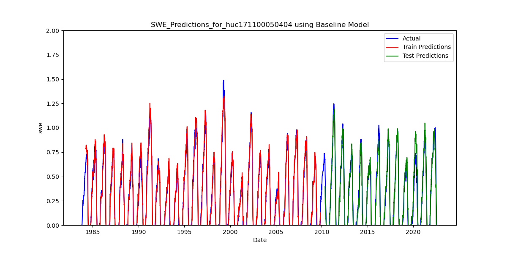
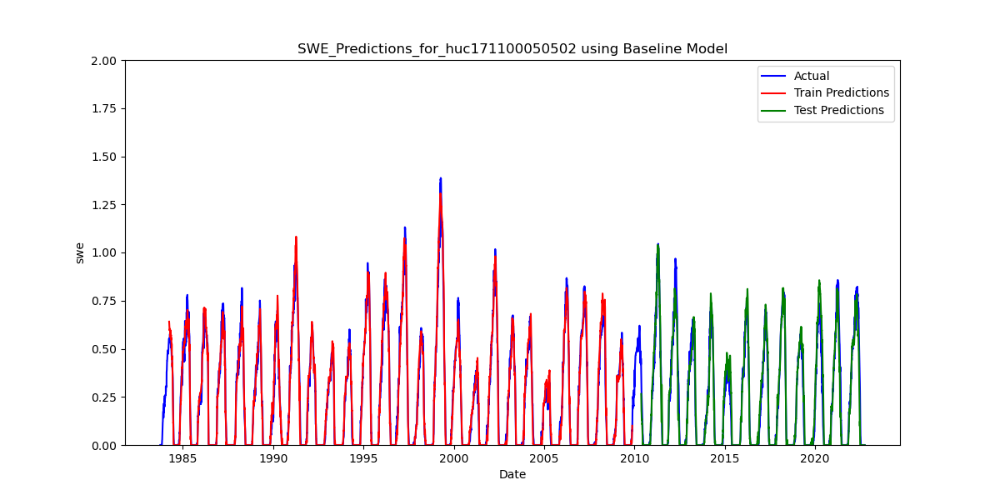
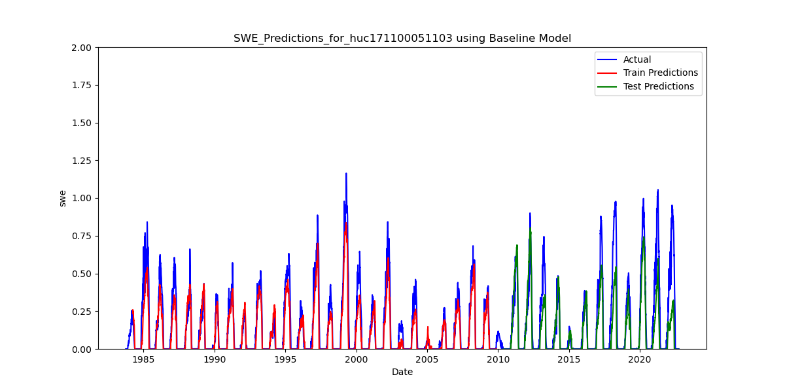
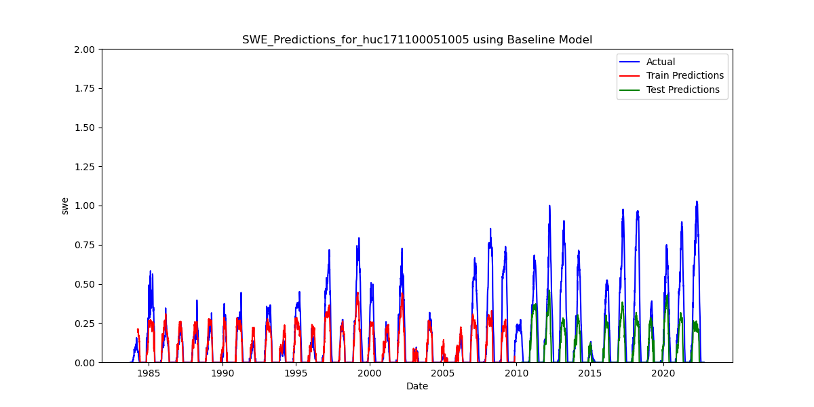

# ** Expirement 1B: Increase Data Granularity **

In expirement 1B, we increased the geographic granularity of the model. Still working in the Skagit basin, we applied the proptyped LSTM model on each sub-watershed (Huc12) 
are rather than the Huc10 areas. Huc regions are defined on a nested structure, where each Huc10 watershed includes multiple smaller, Huc 12 watershed. 
All hyperparameters are unchanged between Expirement 1A and 1B. In this expirement 1B, all sub-watersheds were trained *only* using the data from that sub-watershed,
as noted below by the paramenter (pre_train_fraction = 0).  Train/test split was accomplished by reserving the final two thirds of the time period as test data.  

On average (aggregating to the watershed/HUC10 level), the more granular approach resulted in similar or modest improvements to test_MSE and test_KGE with the exception of waterhshed 1711000511, which showed significant drops in both goodness of fit measures using more granular data. Compare [link] to [link]     

Inspecting the resutls at the sub-watershed level further emphasized diversion of model performance by region.  In particular, regions with a higher percentage of epheneral snow 
performed significantly worse.  

## ProtoTyped Model - Example Results 

## Average Test_MSE and KGE By Watershed - UA Data Modelled at Huc12
| HUC_ID       | Average Test MSE | Average Test KGE |
|--------------|------------------|------------------|
| 1711000504   | 0.005147         | 0.924250         |
| 1711000505   | 0.006710         | 0.931421         |
| 1711000506   | 0.026137         | 0.832154         |
| 1711000507   | 0.021886         | 0.836513         |
| 1711000508   | 0.019096         | 0.814897         |
| 1711000509   | 0.013426         | 0.741316         |
| 1711000510   | 0.041787         | 0.599238         |
| 1711000511   | 0.012682         | 0.655579         |

## Test_MSE and KGE By Watershed - UA Data Modelled at Huc10

| HUC_ID      | Test MSE  | Test KGE  |
|------------|----------|----------|
| 1711000504 | 0.007089 | 0.923201 |
| 1711000505 | 0.004568 | 0.977445 |
| 1711000506 | 0.026291 | 0.701809 |
| 1711000507 | 0.015769 | 0.818750 |
| 1711000508 | 0.029625 | 0.644258 |
| 1711000509 | 0.010326 | 0.806219 |
| 1711000510 | 0.035046 | 0.621083 |
| 1711000511 | 0.003720 | 0.900734 |

## Model Details: ProtoTyped Model - UA Data, Skagit12 
| Parameter           | Value                       |
|---------------------|-----------------------------|
| hidden_size         | 64                          |
| num_class           | 1                           |
| num_layers          | 1                           |
| dropout             | 0.5                         |
| learning_rate       | 0.001                       |
| n_epochs            | 10                          |
| pre_train_fraction  | 0                           |
| train_size_fraction | 0.67                        |
| lookback            | 180                         |
| batch_size          | 16                          |
| n_steps             | 1                           |
| num_workers         | 8                           |
| var_list            | ['mean_pr', 'mean_tair']    |
| experiment_name     | BackToBasics_Skagitt        |
| run_mame            |  nosy-robin-713             |
| run_id              | 215fe6997cc04f4493cce8d003dea9a5      |

