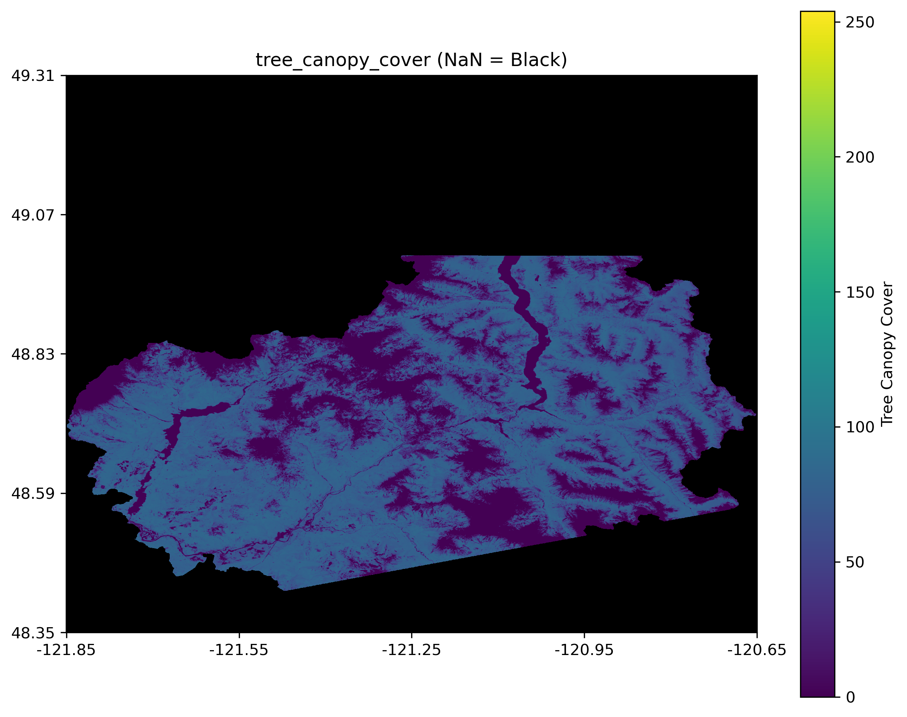

Below graphs desplay Test KGE for each of 533 locally trained Huc12 subwatersheds versus the mean forest cover for that watershed. 

All Snow Types 

Montane Forest

Maritime

Ephemeral

Prairie 

Mean Forest Cover Data is from: https://www.mrlc.gov/data/nlcd-2021-usfs-tree-canopy-cover-conus 
An example of Foret Cover for the Skagit Basin, up to the 49th parallel is below.  

For each Huc12 sub-watershed, mean forest cover is calculated by averaging over all pixels contined within the relevant huc12 geometry.  

