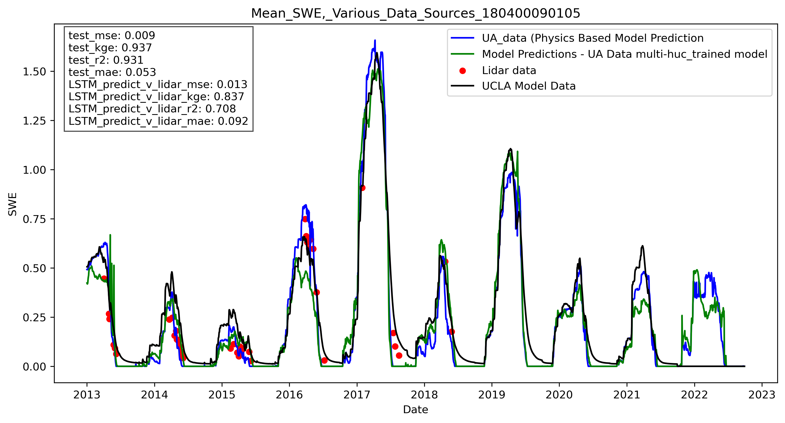
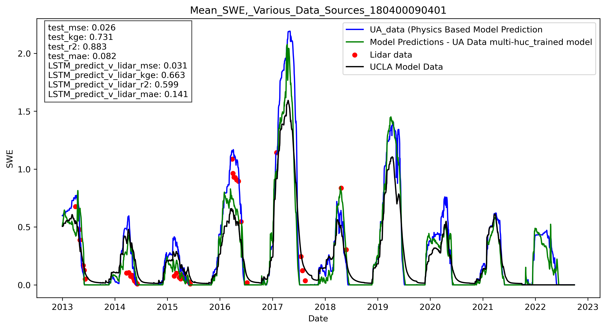

This document discusses results from local training LSTM model on Huc12 sub-watersheds in [Tuolumne valley](basin_fact_sheets/Tuolumne.md).  Huc12 watershed units where epheneral snow dominates were excluded, resulting in 22 sub-watersheds for analysis. 

[Add map] 

Each huc12 was trained with a simple LSTM model, using precipitation and air temperature as the feture inputs, and the University of Arizona re-analysis data for swe estimates. Median KGE was  ___, similar to what was observed in the non-ephemeral sub-watershed in Washington State discussed [here](Ex2_VariationByHuc.md) Charts/results for each of the 22 watersheds available [here](../notebooks/Toloumne/charts/Local_Training_Results).

An example of a well-performing sub-watershed: 

An example of a watershed with more moderate performance: 

Boxplot of performance accross all 22 sub-watershed, by snow-type 

