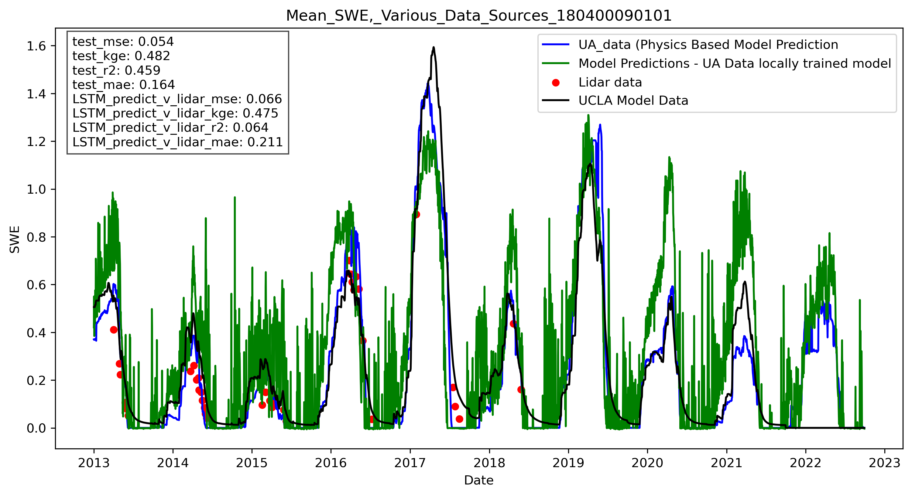
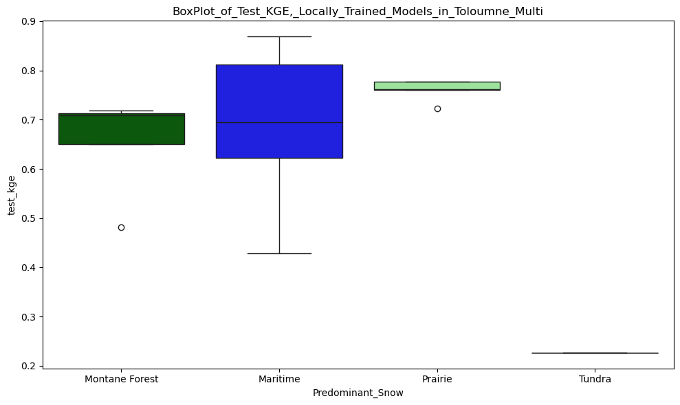
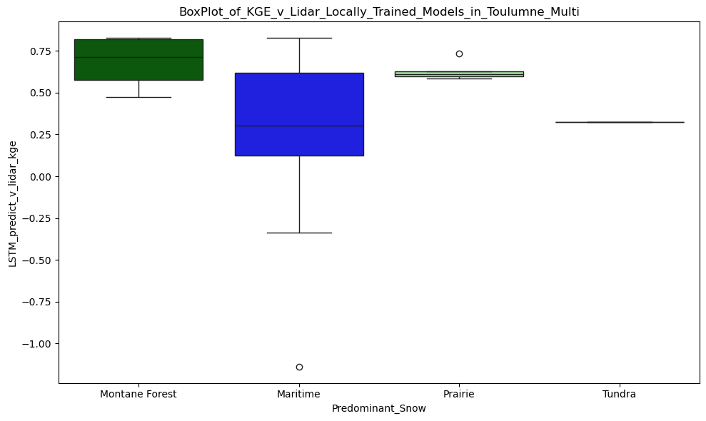

This document discusses results from predictions using a model trained on multiple maritime/montane forest hucs in Washington state applied to SWE estimates for 22 
Huc 12 sub watersheds in Toloumne. Results were mixed.  Full results [here](../notebooks/Toloumne/charts/Multi_Training_Results) and examples below.

An example of a well-performing sub-watershed: 
![Good Example]

An example of a watershed with sub-par test performance results: 

Boxplot of performance against UA data in test period accross all 22 sub-watershed, by snow-type (../notebooks/Toloumne/charts/Multi_Training_Results/UA_Results_and_Lidar_for_huc_180400090301_w_UCLA_dat.png)

Boxplot of performance againes lidar data where available (19 watersheds) by snow-type

