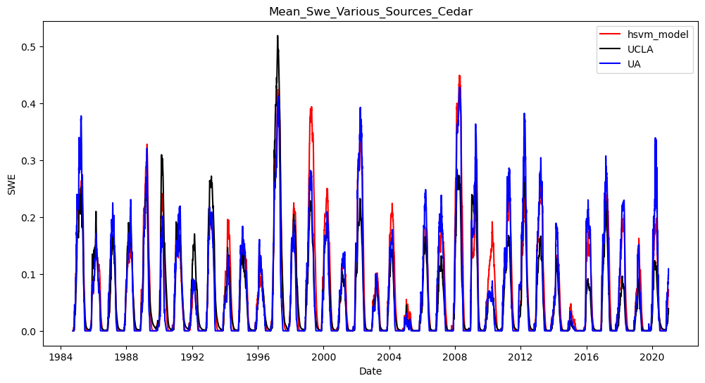
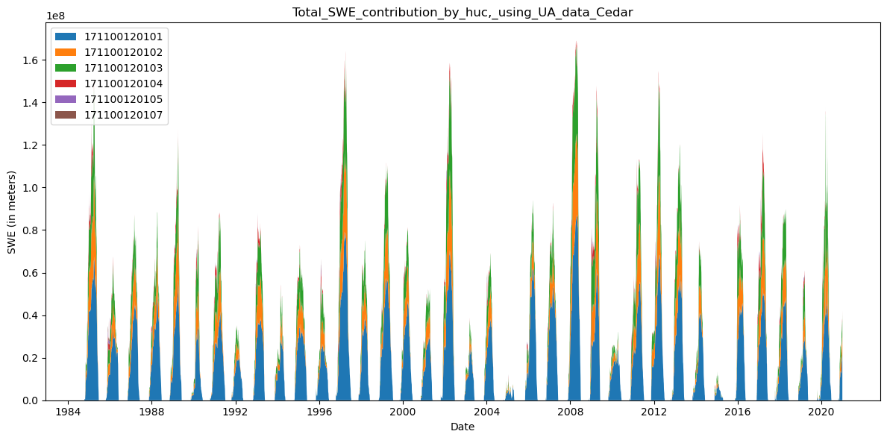

# Cedar (HSVM Model) 

**Name:**             Cedar  
**Huc No:**           Roughly - 1711001201 but excluding 171100120106   
**Predominant Snow:** 
**Huc 12 Sub Units By Predominant Snow Classification:**
- Maritime: 1
- Maritime/Ephem 50/50 Split: 3
- Ephemeral: 3

## SWE Estimates Various Sources 

| Dataset 1 | Dataset 2 | Pearson Corr | Ratio_var | Ratio_means | R-squared |
|-----------|-----------|---------------|-----------|--------------|-----------|
| DHSVM     | UA        | 0.935         | 0.995     | 1.100        | 0.865     |
| DHSVM     | UCLA      | 0.907         | 1.161     | 1.231        | 0.799     |
| UA        | UCLA      | 0.892         | 1.167     | 1.120        | 0.788     |

  
## Shapefile Comparison to HUC12s 

| Dataset 1 | Dataset 2 | Pearson Corr | Ratio_var | Ratio_means | R-squared |
|-----------|-----------|---------------|-----------|--------------|-----------|
| UA        | UA_huc    | 0.999         | 1.123     | 1.139        | 0.979     |

## Cedar Map with Snow Classification 

Snow Classification Data Reference: 
- Sturm, M., and G. E. Liston, 2021: Revisiting the global seasonal snow classification: An updated dataset for Earth System applications.  Journal of Hydrometeorology, 22, 2917-2938, https://doi.org/10.1175/JHM-D-21-0070.1.
- Liston, G. E., and M. Sturm, 2021: Global Seasonal-Snow Classification, Version 1. National Snow and Ice Data Center, https://doi.org/10.5067/99FTCYYYLAQ0.

## SWE Contribution by HUC 

## Cedar Elevation Map 

Elevation Data Reference 
- Copernicus Global Digital Elevation Models, at 90 m scale (COP90)
- European Space Agency (2024).  <i>Copernicus Global Digital Elevation Model</i>.  Distributed by OpenTopography. 
