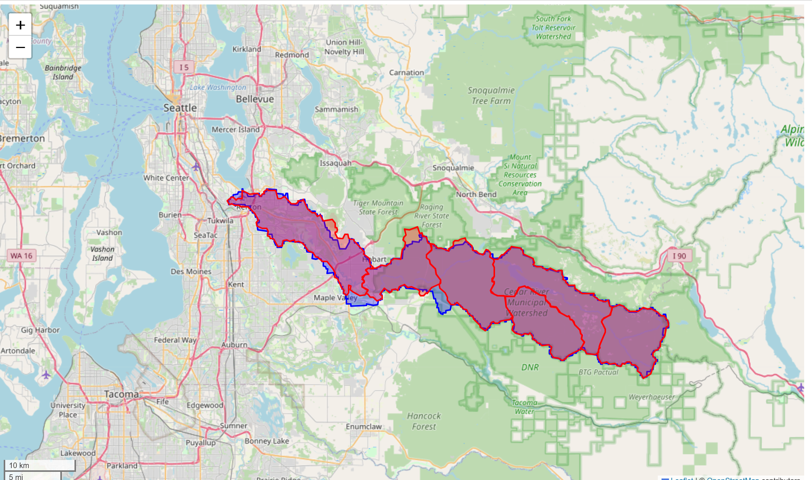
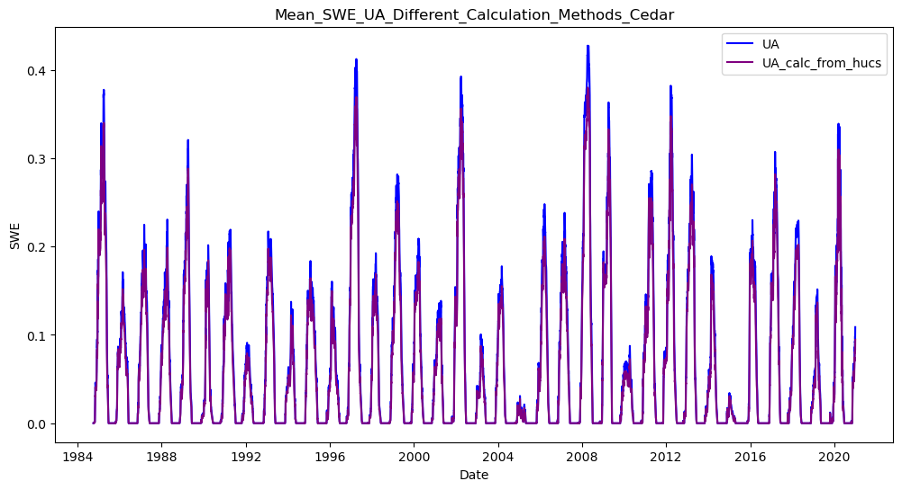
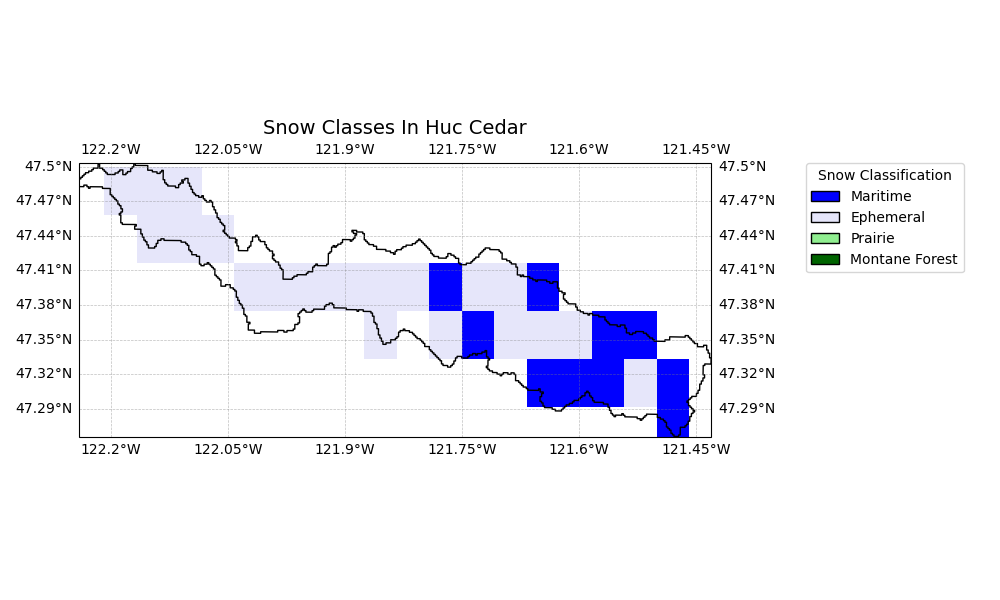

# Cedar (HSVM Model) 

**Name:**             Cedar  
**Huc No:**           Roughly - 1711001201 but excluding 171100120106   
**Huc 12 Sub Units By Predominant Snow Classification:**
- Maritime: 1
- Maritime/Ephem 50/50 Split: 3
- Ephemeral: 3

## SWE Estimates Various Sources 

**Similarity of Mean SWE Estimates**
| Dataset 1 | Dataset 2 | Pearson Corr | Ratio_var | Ratio_means | R-squared |
|-----------|-----------|---------------|-----------|--------------|-----------|
| DHSVM     | UA        | 0.935         | 0.995     | 1.100        | 0.865     |
| DHSVM     | UCLA      | 0.907         | 1.161     | 1.231        | 0.799     |
| UA        | UCLA      | 0.892         | 1.167     | 1.120        | 0.788     |

Comment: Relatively good correspondence between all three datasets.  UA a slightly better match to DHSCV than UCLA.  
  
## Shapefile Comparison 
**Visual of Shape File Used in DHSVM Compared with Huc12 geos in 1711001201 but excluding 17110012010**

**Mean SWE Estimate Comparison - DHSVM Shapefile compared with aggregating over HUC12 shapes**

**Similarity of Mean SWE Estimates**
| Dataset 1 | Dataset 2 | Pearson Corr | Ratio_var | Ratio_means | R-squared |
|-----------|-----------|---------------|-----------|--------------|-----------|
| UA        | UA_huc    | 0.999         | 1.123     | 1.139        | 0.979     |

Comment: Estimating by HUC and aggregating should get very close to results using shapefile directly.  

## Cedar Map with Snow Classification 

Comment:  Estimating all of Cedar will bring in a lot of area dominated by Ephemeral snow, which we know is harder to estimate.  Since total SWE is dominated by the HUCs that are not ephemeral snow, however (see next map) this may be manageable. 

## SWE Contribution by HUC 

