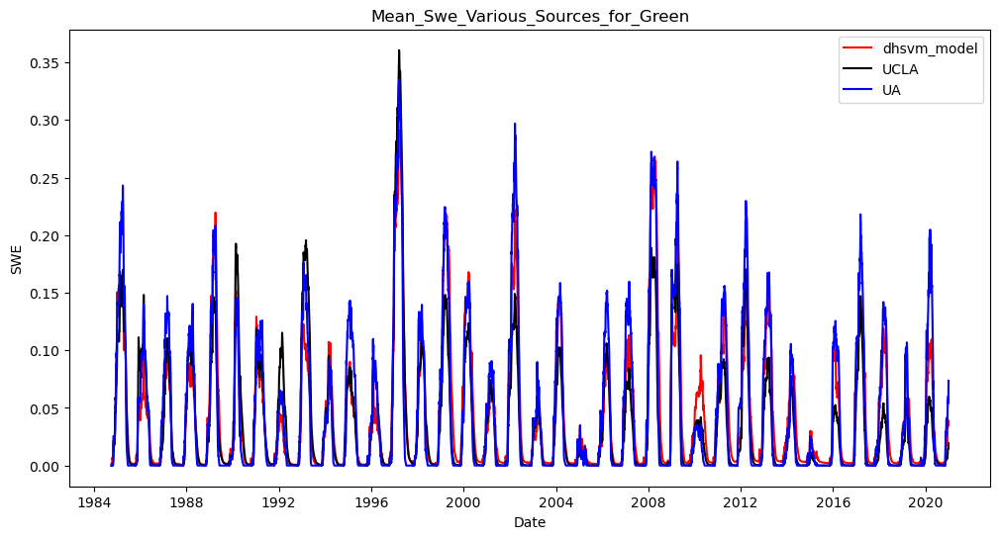

# Green (DHSVM Model) 

**Name:**             Green  
**Huc No:**           Roughly - all of 17110013 (a HUC08)  
**Huc 12 Sub Units By Predominant Snow Classification:**
- Maritime: 5
- Ephemeral: 11 (8 of these are 100% Ephem)

## SWE Estimates Various Sources 

**Similarity of Mean SWE Estimates**
| Dataset 1 | Dataset 2 | Pearson Corr | Ratio_var | Ratio_means | R-squared |
|-----------|-----------|---------------|-----------|--------------|-----------|
| DHSVM     | UA        | 0.948         | 0.846     | 0.953        | 0.843     |
| DHSVM     | UCLA      | 0.906         | 1.051     | 1.191        | 0.803     |
| UA        | UCLA      | 0.916         | 1.242     | 1.250        | 0.807     |

Comment: Relatively good correspondence between all three datasets.  UA a slightly better match to DHSCM than UCLA.  
  
## Shapefile Comparison 
**Visual of Shape File Used in DHSVM Compared with Huc12 geos in 1711001201 but excluding 17110012010**

**Mean SWE Estimate Comparison - DHSVM Shapefile compared with aggregating over HUC12 shapes**

**Similarity of Mean SWE Estimates**

| Dataset 1 | Dataset 2 | Pearson Corr | Ratio_var | Ratio_means | R-squared |
|-----------|-----------|---------------|-----------|--------------|-----------|
| UA        | UA_huc    | 0.999         | 0.930     | 0.916        | 0.989     |

Comment: Estimating by HUC and aggregating should get close to results using shapefile directly but differences are material.   

## Green Map with Snow Classification 

Comment:  Estimating all of Green will bring in a lot of area dominated by Ephemeral snow, which we know is harder to estimate.  Total SWE is dominated by the HUCs that are not ephemeral snow, however (see next chart) this may be manageable, although Green has more contribution from Ephemeral snow than Cedar.   

## SWE Contribution by HUC 

