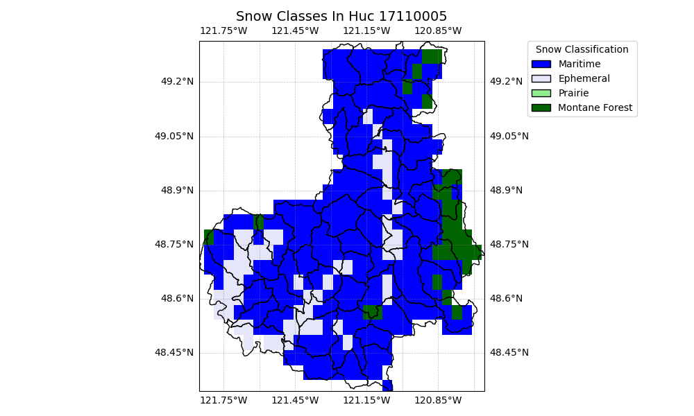

# Skagitt

**Name:**             Skagitt  
**Huc No:**           17110005   
**Predominant Snow:** Maritime  
**Huc 12 Sub Units By Predominant Snow Classification:**
- Maritime: 52
- Montane Forest: 3
- Ephemeral: 2

## Skagit Map with Snow Classification 

Attribution:  TO ADD - ATTRIBUTION FOR SNOW CLASS DATA 

