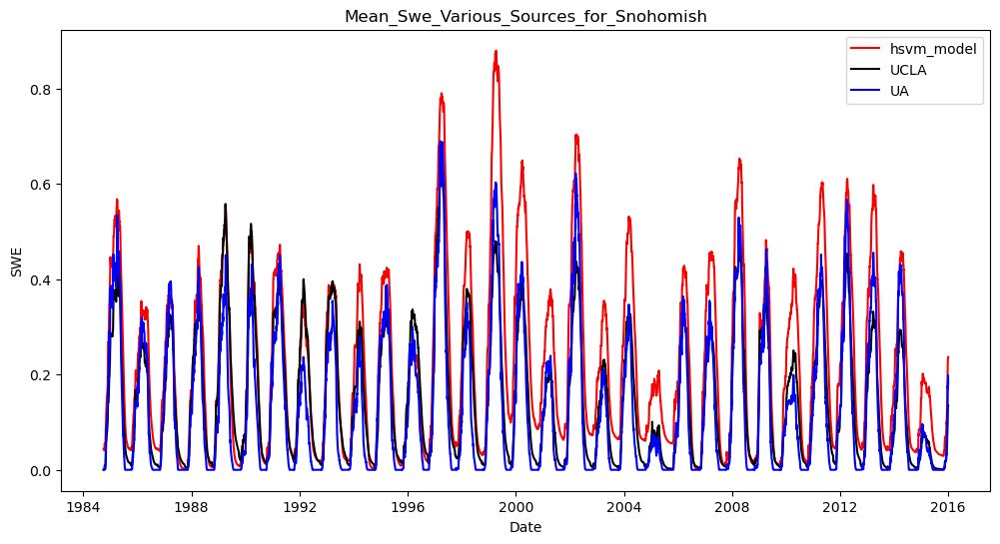
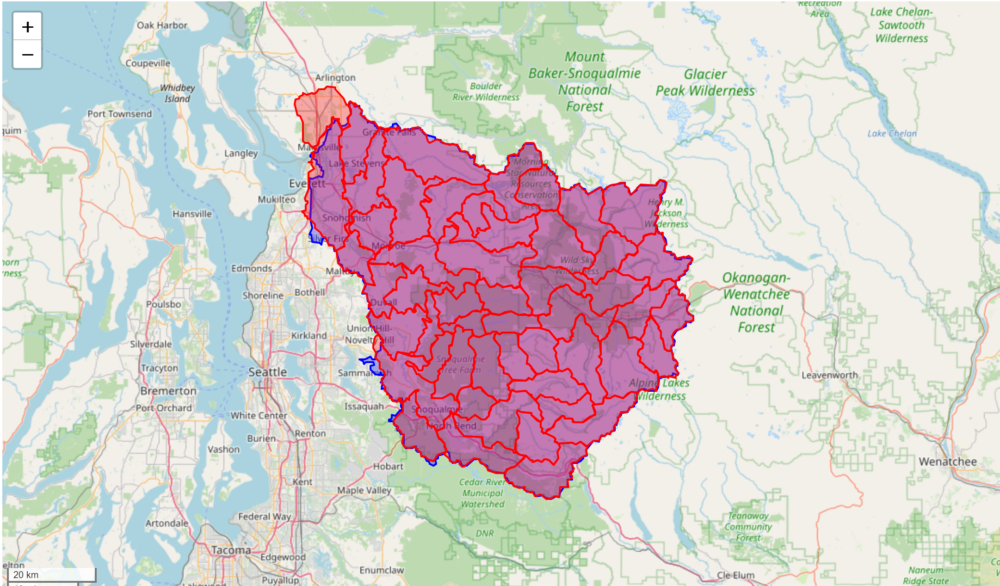
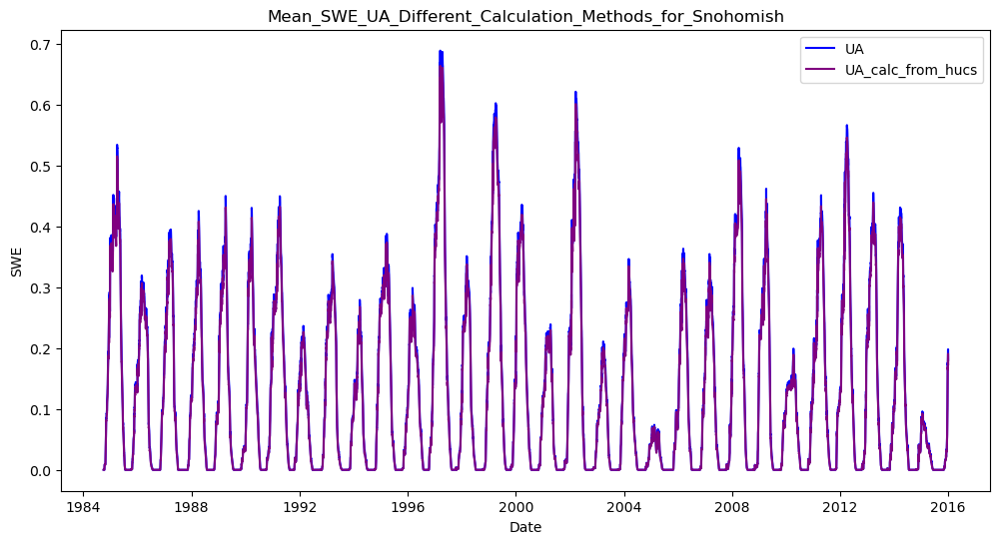
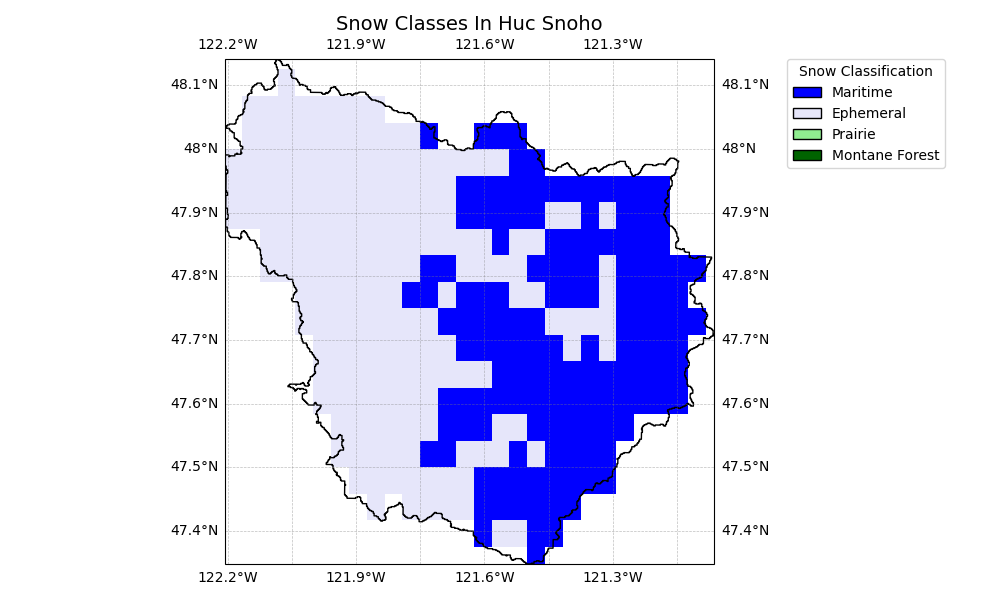

# Snohomish (DHSVM Model) 

**Name:**             Snohomish  
**Huc No:**           Roughly - all of 17110011, 17110012, and 1711009  (e.g. combination of 3 Huc08)   
**Huc 12 Sub Units By Predominant Snow Classification:**
- Maritime: 15
- Ephemeral: 6

## SWE Estimates Various Sources 

**Similarity of Mean SWE Estimates**

| Dataset 1 | Dataset 2 | Pearson Corr | Ratio_var | Ratio_means | R-squared |
|-----------|-----------|---------------|-----------|--------------|-----------|
| DHSVM     | UA        | 0.931         | 1.262     | 1.755        | 0.582     |
| DHSVM     | UCLA      | 0.929         | 1.354     | 1.503        | 0.666     |
| UA        | UCLA      | 0.941         | 1.073     | 0.856        | 0.864     |

Comment: Lots of summer snow in DHSVM model.  UCLA better match to DHSVM than UA; neither great.  

## Shapefile Comparison
Visual of Shape File Used in DHSVM Compared with Huc12 geos  
Blue = shapefile from DHSVM model; Red = shapefile built from HUC geometries 

## Mean SWE Estimate Comparison - DHSVM Shapefile compared with aggregating over HUC12 shapes 

Similarity of Mean SWE Estimates

| Dataset 1 | Dataset 2 | Pearson Corr | Ratio_var | Ratio_means | R-squared |
|-----------|-----------|---------------|-----------|--------------|-----------|
| UA        | UA_huc    | 1.000         | 1.040     | 1.046        | 0.997     |

Comment: Estimating by HUC and aggregating should get very close to results using shapefile directly.

## Snoho Map with Snow Classification

