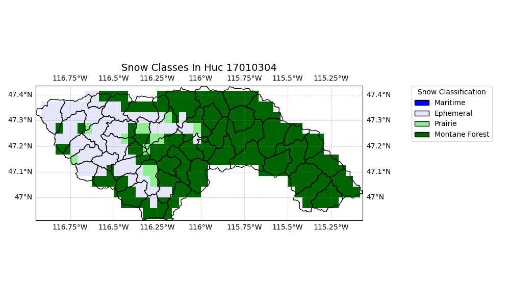
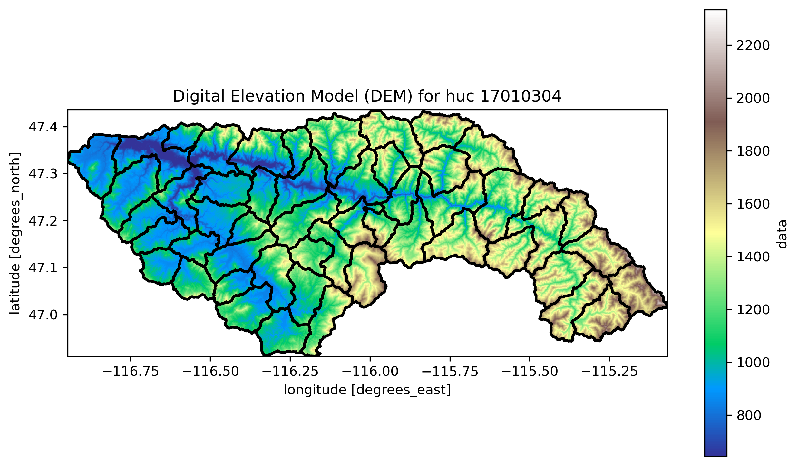

#  St. Joe 

**Name:**     St. Joe            
**Huc No:**           17010304   
**Predominant Snow:**  Montane Forest  
**Huc 12 Sub Units By Predominant Snow Classification:**
- Montane Forest: 36
- Ephemeral: 16
- Other (Prarie): 1 

##   St. Joe  Map with Snow Classification 

Snow Classification Data Reference: 
- Sturm, M., and G. E. Liston, 2021: Revisiting the global seasonal snow classification: An updated dataset for Earth System applications.  Journal of Hydrometeorology, 22, 2917-2938, https://doi.org/10.1175/JHM-D-21-0070.1.
- Liston, G. E., and M. Sturm, 2021: Global Seasonal-Snow Classification, Version 1. National Snow and Ice Data Center, https://doi.org/10.5067/99FTCYYYLAQ0.

  ##  St. Joe  Elevation Map 

Elevation Data Reference 
- Copernicus Global Digital Elevation Models, at 90 m scale (COP90)
- European Space Agency (2024).  <i>Copernicus Global Digital Elevation Model</i>.  Distributed by OpenTopography
