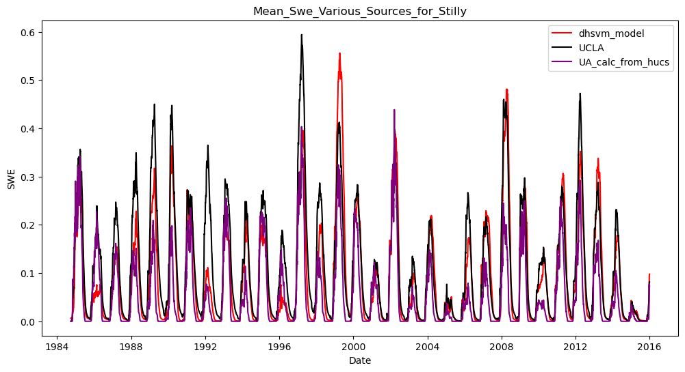
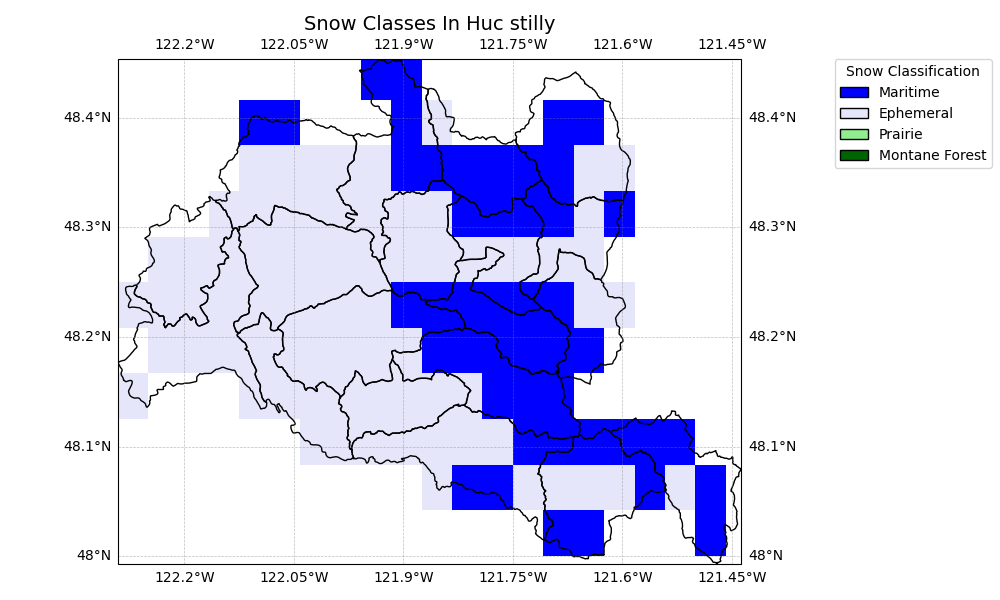

## Stilly (DHSVM Model)

**Name:** Stillaguamish (sp?)  
**Huc No:** Roughly 17110008 but excluding 171100080304  
**Huc 12 Sub Units By Predominant Snow Classification:**  

Maritime: 13  
Ephemeral: 7  

## SWE Estimates Various Sources 

**Similarity of Mean SWE Estimates**

| Dataset 1     | Dataset 2       | Pearson Corr | Ratio_var | Ratio_means | R-squared |
|---------------|------------------|---------------|-----------|--------------|-----------|
| DHSVM         | UA_from_hucs     | 0.828         | 1.392     | 1.688        | 0.559     |
| DHSVM         | UCLA_from_hucs   | 0.908         | 0.914     | 0.803        | 0.749     |
| UA_from_hucs  | UCLA_from_hucs   | 0.864         | 0.657     | 0.476        | -0.259    |

Comment:   

## Shapefile Comparison 
**Visual of Shape File From DHSVM**

I was unable to successful conver the shapefile given to a CRS.  But eyeballing it appears to be roughly the shape of 17110008 but excluding 171100080304

**Mean SWE Estimate Comparison - DHSVM Shapefile compared with aggregating over HUC12 shapes**
n/a - cannot calculate UCLA SWE using DHSVM shapefile without ability to convert to a known coordinate system 

# Stilly Map with Snow Classification 

