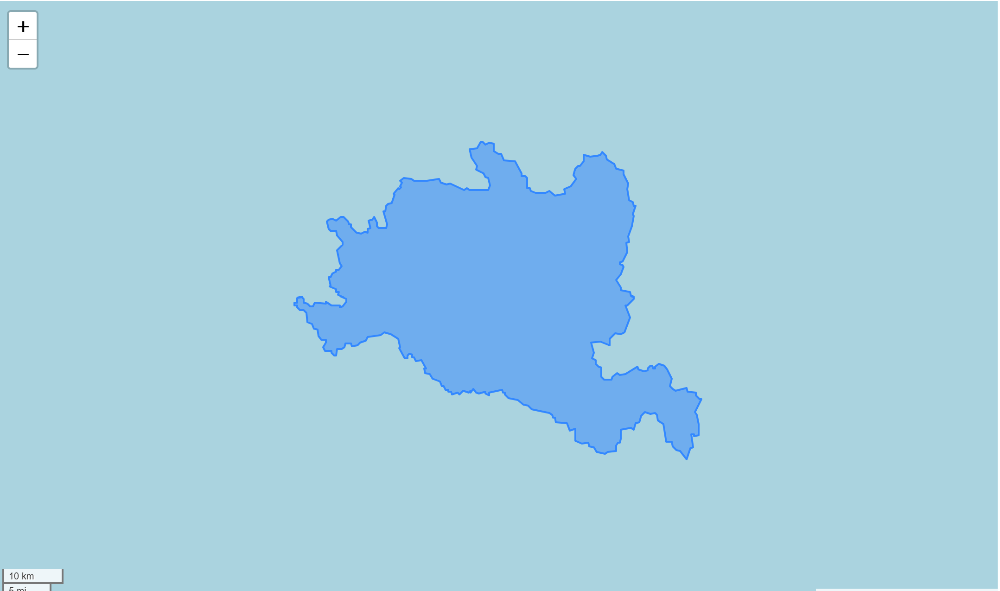
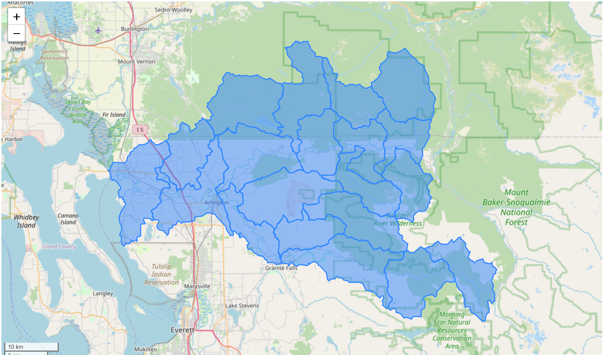

## Stilly (DHSVM Model)

**Name:** Stillaguamish (sp?)  
**Huc No:** Roughly 17110008 but excluding 171100080304  
**Huc 12 Sub Units By Predominant Snow Classification:**  

Maritime: 13  
Ephemeral: 7  

## SWE Estimates Various Sources 

**Similarity of Mean SWE Estimates**

TO BE INSERTED 

Comment:   

## Shapefile Comparison 
**Visual of Shape File From DHSVM**

I was unable to successful conver the shapefile given to a CRS.  But eyeballing it appears to be roughly the shape of 17110008 but excluding 171100080304

**Mean SWE Estimate Comparison - DHSVM Shapefile compared with aggregating over HUC12 shapes**
n/a - cannot calculate UCLA SWE using DHSVM shapefile without ability to convert to a known coordinate system 
