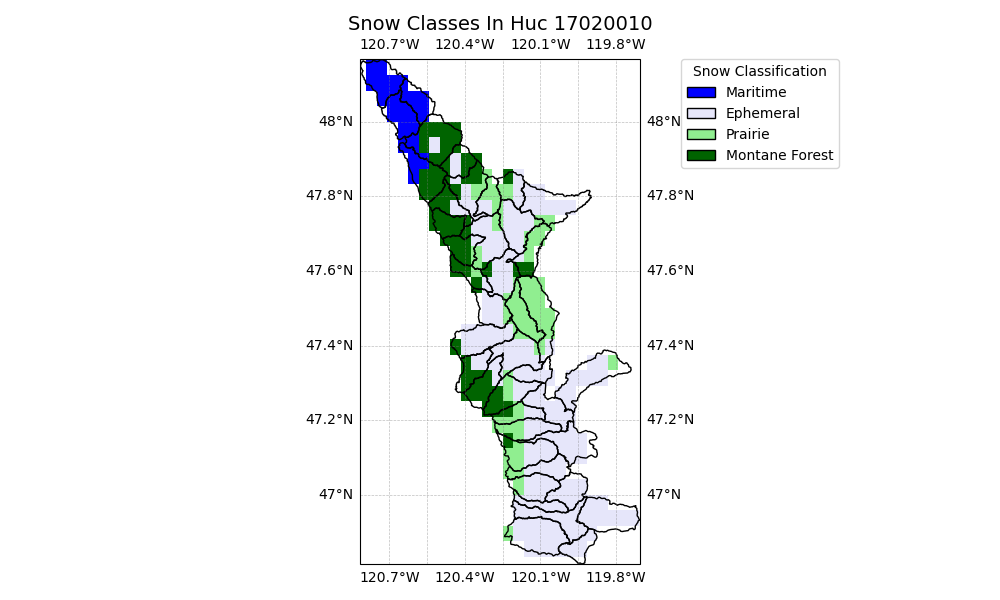
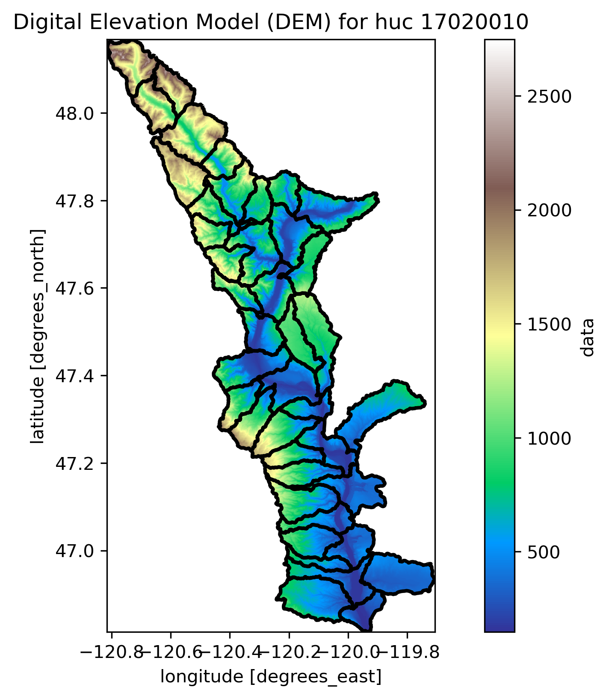

# Upper Columbia-Entiat

**Name:**             Upper Columbia-Entiat  
**Huc No:**           17020010   
**Predominant Snow:** Maritime  
**Huc 12 Sub Units By Predominant Snow Classification:**
- Maritime: 3
- Montane Forest: 10
- Ephemeral: 24
- Other: 4 (Prairie) 

## Upper Columbia-Entiat with Snow Classification 

Snow Classification Data Reference: 
- Sturm, M., and G. E. Liston, 2021: Revisiting the global seasonal snow classification: An updated dataset for Earth System applications.  Journal of Hydrometeorology, 22, 2917-2938, https://doi.org/10.1175/JHM-D-21-0070.1.
- Liston, G. E., and M. Sturm, 2021: Global Seasonal-Snow Classification, Version 1. National Snow and Ice Data Center, https://doi.org/10.5067/99FTCYYYLAQ0.

## Upper Columbia-Entiat Elevation Map 

